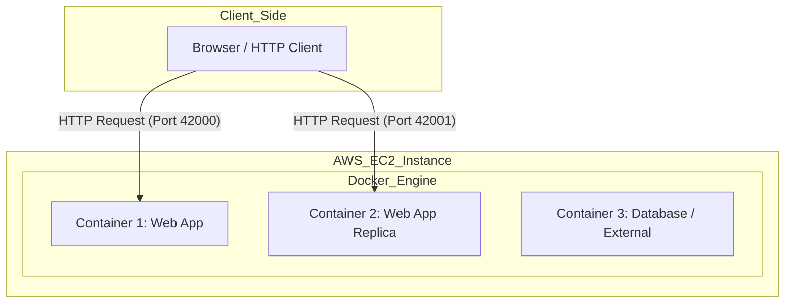

# AREP-Docker-Intro


> A project focused on web application modularization using Docker containerization and AWS EC2 deployment, featuring a custom concurrent Java framework and multi-container orchestration.

---

## Table of Contents

- [Overview](#overview)
- [Architecture](#architecture)
- [Project Structure](#project-structure)
- [Getting Started](#getting-started)
  - [Prerequisites](#prerequisites)
  - [Local Installation](#local-installation)
  - [Docker Execution](#docker-execution)
  - [AWS Deployment](#aws-deployment)
- [Features](#features)
- [Demonstration](#demonstration)
- [Evaluation Rubric](#evaluation-rubric)
- [Author](#author)
- [License](#license)

---

## Overview

This repository holds a modular web application built from scratch to support concurrent HTTP requests. The primary goal is to containerize the server using **Docker**, orchestrate services with **Docker Compose**, and ultimately deploy the images to a virtual machine in the cloud utilizing **AWS EC2**.

This practice reinforces concepts of virtualized micro-frameworks and graceful shutdowns.

---

## Architecture

The project consists of a basic Web Server Core acting as an HTTP endpoint, which delegates tasks to REST definitions. Once built, the Java artifacts are packaged into a lightweight `openjdk` Docker container.

### System Diagram



> [!TIP]
> The framework incorporates a `Runtime.getRuntime().addShutdownHook(...)` to softly terminate threads and close sockets before the JVM fully halts. This prevents data corruption and dangling ports.

---

## Project Structure

```text
AREP-Docker-Intro/
├── pom.xml
├── README.md
├── docker-compose.yml
├── Dockerfile
├── src/
│   ├── main/java/...
│   └── test/java/...
└── resources/
    ├── img/
    └── moodle.md
```

---

## Getting Started

### Prerequisites

- **Java SDK 17+**
- **Apache Maven 3+**
- **Docker** and **Docker Compose**

### Local Installation

Clone the repository and compile the Java artifacts:

```bash
git clone https://github.com/USER/AREP-Docker-Intro.git
cd AREP-Docker-Intro

# Compile the project and copy target dependencies
mvn clean package
```

> [!IMPORTANT]
> The `maven-dependency-plugin` is utilized to gather all `.jar` libraries into the `target/dependency` path, which is critical for Docker image creation.

### Docker Execution

#### 1. Build the single image
```bash
docker build --tag custom-docker-app .
```

#### 2. Run standalone containers
Start the app on isolated ports binding to `6000` internally:
```bash
docker run -d -p 34000:6000 --name webapp_1 custom-docker-app
docker run -d -p 34001:6000 --name webapp_2 custom-docker-app
```

#### 3. Run with Docker Compose
If you prefer an automated multi-container setup (e.g., App + MongoDB):
```bash
docker-compose up -d
```

> [!NOTE]
> Verify your running containers by typing `docker ps` in your terminal.

### AWS Deployment

To deploy this image on an EC2 instance:
1. SSH into your Amazon Linux EC2 instance.
2. Install docker: `sudo yum install docker` and start the service: `sudo service docker start`.
3. Pull the image pushed to DockerHub (e.g., `docker pull <your-username>/custom-docker-app`).
4. Run the container just as you would locally.

> [!WARNING]
> You must manually open the specific TCP ports under the **Inbound Rules** of your EC2 Security Group for the web traffic to reach your Docker container.

---

## Features

- [x] **Concurrent Requests**: Capable of handling multiple simultaneous socket connections using thread pools.
- [x] **Graceful Shutdown**: Employs JVM shutdown hooks to close threads securely.
- [x] **Dockerized Artifact**: Container image leveraging OpenJDK base.
- [x] **Cloud Ready**: Configured for seamless AWS EC2 integration.

---

## Demonstration

> [!TIP]
> **Video / Screenshots Placeholder**
> Add visual proof of the application running locally and in the AWS EC2 cloud infrastructure.

*(Insert video link or screenshots of AWS tests here)*

---

## Evaluation Rubric

| General Information | Detail |
| :--- | :--- |
| **Programmer's Name** | |
| **Repository Link on GitHub** | |
| **Reviewer’s Name** | |
| **Review Date** | |

| Deliverables | Reference | Evaluation |
| :--- | :---: | :---: |
| Deployed on GitHub | 1 | 1 |
| Complete .gitignore file | 1 | 1 |
| Has README.md | 1 | 1 |
| Contains no unnecessary files or folders | 1 | 1 |
| Has a POM.xml | 1 | 1 |
| Respects Maven structure | 1 | 1 |
| Does not contain the target folder | 1 | 1 |
| **Subtotal Deliverables** | **7** | **7** |

| Design and Architecture | Reference | Evaluation |
| :--- | :---: | :---: |
| The framework supports concurrent requests, improving upon the previous version. | 5 | 5 |
| The framework shuts down gracefully using a Runtime Hook activated in a thread. | 5 | 5 |
| Meets all other functional requirements | 3 | 3 |
| Meets quality attributes | 3 | 3 |
| The system has been deployed to a Docker container running in an EC2 instance on AWS. | 10 | 10 |
| System design seems reasonable for the problem | 3 | 3 |
| Design is well documented in the README.md | 3 | 3 |
| README contains installation and usage instructions | 3 | 3 |
| README shows evidence of tests | 3 | 3 |
| Has automated tests | 3 | 3 |
| Repository can be cloned and executed | 3 | 3 |
| **Subtotal Design** | **44** | **44** |

| Summary | Points | Evaluation |
| :--- | :---: | :---: |
| **Total** | **51** | **51** |
| **Final Grade** | **5** | **5** |

---

## Author

**Sergio Andrey Silva Rodriguez**  
*Systems Engineering Student*  
Escuela Colombiana de Ingeniería Julio Garavito

## License

This project is for educational purposes as part of the AREP course at Escuela Colombiana de Ingeniería Julio Garavito.
