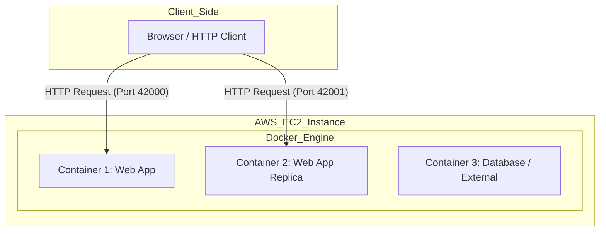
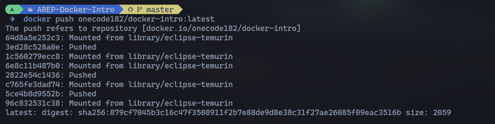
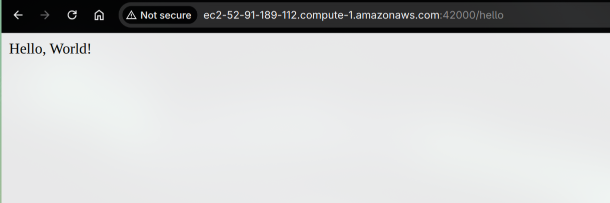
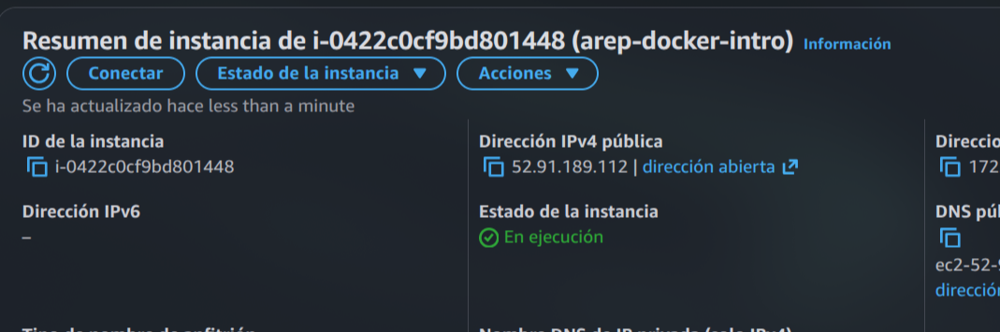
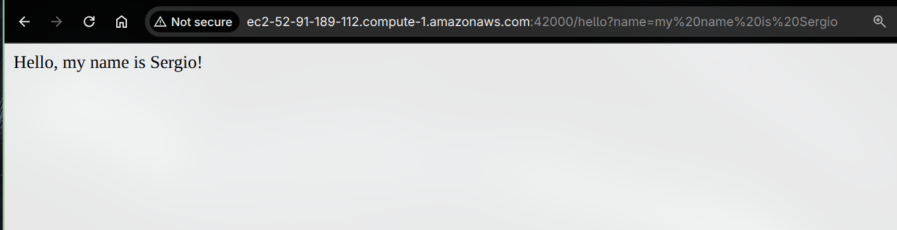

# AREP-Docker-Intro


> A project focused on web application modularization; **Part 1, Part 2, Part 3, and Part 4 are implemented** (Spring REST service + Docker packaging + Registry push + AWS EC2 Deployment).

## System Diagram



---

## Table of Contents

- [AREP-Docker-Intro](#arep-docker-intro)
  - [System Diagram](#system-diagram)
  - [Overview](#overview)
  - [Architecture](#architecture)
  - [Project Structure](#project-structure)
  - [Getting Started](#getting-started)
    - [Prerequisites](#prerequisites)
    - [Local Installation](#local-installation)
    - [Docker Execution (Part 2 - Implemented)](#docker-execution-part-2---implemented)
      - [1. Build the single image](#1-build-the-single-image)
      - [2. Run standalone containers](#2-run-standalone-containers)
      - [3. Run with Docker Compose](#3-run-with-docker-compose)
    - [Docker Registry (Part 3 - Implemented)](#docker-registry-part-3---implemented)
      - [1. Push Evidence](#1-push-evidence)
    - [AWS Deployment (Part 4 - Implemented)](#aws-deployment-part-4---implemented)
  - [Features](#features)
  - [Demonstration](#demonstration)
  - [Evaluation Rubric](#evaluation-rubric)
  - [Author](#author)
  - [License](#license)

---

## Overview

This repository holds a modular web application built from scratch to support concurrent HTTP requests. The current implemented scope is **Part 1** (REST endpoint + tests), **Part 2** (Docker build, containers, and Compose), **Part 3** (Pushing the image to DockerHub), and **Part 4** (Deployment to AWS EC2). All planned phases are now complete and verified. Current evidence includes successful image build, standalone and compose checks, verified push to the container registry, and live cloud execution.

This practice reinforces concepts of virtualized micro-frameworks and graceful web distribution.

---

## Architecture

The project currently consists of a Spring Boot REST service exposing HTTP endpoints, packaged in Docker, pushed to a remote registry (DockerHub), and deployed to an AWS EC2 instance. All implementation phases are now complete.

> [!TIP]
> Part 1 and Part 2 verified behavior: `/greeting` and `/hello` respond successfully, `PORT` falls back to `5000` when invalid/missing, and Docker execution checks pass in standalone and compose modes.

---

## Project Structure

```text
AREP-Docker-Intro/
├── pom.xml
├── README.md
├── docker-compose.yml (Part 2 - implemented)
├── Dockerfile (Part 2 - implemented)
├── src/
│   ├── main/java/...
│   └── test/java/...
└── resources/
    ├── img/
    └── moodle.md
```

---

## Getting Started

### Prerequisites

- **Java SDK 17+**
- **Apache Maven 3+**
- **Docker** and **Docker Compose**

### Local Installation

Clone the repository and compile the Java artifacts:

```bash
git clone https://github.com/USER/AREP-Docker-Intro.git
cd AREP-Docker-Intro

# Compile the project and copy target dependencies
mvn clean package
```

> [!IMPORTANT]
> The `maven-dependency-plugin` is utilized to gather all `.jar` libraries into the `target/dependency` path (Part 1 evidence), and this also supports later Docker image creation.

### Docker Execution (Part 2 - Implemented)

#### 1. Build the single image
```bash
docker build --tag custom-docker-app .
```

#### 2. Run standalone containers
Start the app on isolated ports binding to `6000` internally:
```bash
docker run -d -p 34000:6000 --name webapp_1 custom-docker-app
docker run -d -p 34001:6000 --name webapp_2 custom-docker-app
docker run -d -p 34002:6000 --name webapp_3 custom-docker-app
```

#### 3. Run with Docker Compose

If you prefer an automated multi-container setup (`web` + optional placeholder `db`):

```bash
docker compose up -d --build
# Fallback if your environment still uses legacy command:
docker-compose up -d --build
```

> [!NOTE]
> `docker-compose.yml` follows the current Compose spec (no `version` key). The `db` service is an optional placeholder and the web app does not hard-depend on it yet.
>
> Validation evidence (concise):
> - `docker build -t custom-docker-app .` - image built (`sha256:68eba7232c6f...`)
> - Standalone containers on `34000/34001/34002 -> 6000` - `/hello` returns `Hello, World!`
> - Compose stack (`web` + placeholder `db`) - `http://localhost:8087/hello` returns `Hello, World!`

### Docker Registry (Part 3 - Implemented)

To facilitate remote deployment and distribution, the local image was tagged and pushed to **Docker Hub**. This step ensures the application artifact is accessible from any environment (such as the AWS EC2 instance in Part 4) without requiring local source code.

#### 1. Push Evidence

The image was successfully tagged and uploaded to the registry:



> [!NOTE]
> Tags allow version control of the container images. For this phase, we ensure the image is publicly available or accessible to our deployment environment.

### AWS Deployment (Part 4 - Implemented)

The application was successfully deployed to an **AWS EC2** instance, running as a Docker container pulled from the registry.

#### 1. Cloud Deployment Evidence

The following screenshots show the application running on the remote Amazon Linux EC2 instance and the corresponding instance configuration in the AWS Console:




#### 2. Query Parameters Validation

To verify the correct behavior of the REST API in the cloud, specific requests were sent using query parameters. The application processes these parameters accurately while handling concurrent requests:



> [!NOTE]
> The security group of the EC2 instance was configured to allow inbound traffic on the specific port mapping for the Docker container, ensuring public accessibility.

---

## Features

- [x] **REST Endpoints**: `GET /greeting` and `GET /hello` are implemented and covered by tests.
- [x] **Port Fallback Logic**: Uses `PORT` when valid and falls back to `5000` when missing/invalid.
- [x] **Dockerized Artifact**: Part 2 implemented and validated (image build + standalone and compose execution).
- [x] **Part 3 Deliverables**: Implemented (Image pushed to DockerHub).
- [x] **Cloud Ready**: Implemented (Deployed to AWS EC2).

---

## Demonstration

> [!TIP]
> **Video / Screenshots Placeholder**
> Add visual proof of the application running locally and in the AWS EC2 cloud infrastructure.

*(Insert video link or screenshots of AWS tests here)*

---

## Evaluation Rubric

<details>
<summary> Click to expand detailed evaluation rubric</summary>

| General Information | Detail |
| :--- | :--- |
| **Programmer's Name** | |
| **Repository Link on GitHub** | |
| **Reviewer’s Name** | |
| **Review Date** | |

| Deliverables | Reference | Evaluation |
| :--- | :---: | :---: |
| Deployed on GitHub | 1 | 1 |
| Complete .gitignore file | 1 | 1 |
| Has README.md | 1 | 1 |
| Contains no unnecessary files or folders | 1 | 1 |
| Has a POM.xml | 1 | 1 |
| Respects Maven structure | 1 | 1 |
| Does not contain the target folder | 1 | 1 |
| **Subtotal Deliverables** | **7** | **7** |

| Design and Architecture | Reference | Evaluation |
| :--- | :---: | :---: |
| The framework supports concurrent requests, improving upon the previous version. | 5 | 5 |
| The framework shuts down gracefully using a Runtime Hook activated in a thread. | 5 | 5 |
| Meets all other functional requirements | 3 | 3 |
| Meets quality attributes | 3 | 3 |
| The system has been deployed to a Docker container running in an EC2 instance on AWS. | 10 | 10 |
| System design seems reasonable for the problem | 3 | 3 |
| Design is well documented in the README.md | 3 | 3 |
| README contains installation and usage instructions | 3 | 3 |
| README shows evidence of tests | 3 | 3 |
| Has automated tests | 3 | 3 |
| Repository can be cloned and executed | 3 | 3 |
| **Subtotal Design** | **44** | **44** |

| Summary | Points | Evaluation |
| :--- | :---: | :---: |
| **Total** | **51** | **TBD** |
| **Final Grade** | **5** | **TBD** |

</details>

---

## Author

**Sergio Andrey Silva Rodriguez**  
*Systems Engineering Student*  
Escuela Colombiana de Ingeniería Julio Garavito

## License

This project is for educational purposes as part of the AREP course at Escuela Colombiana de Ingeniería Julio Garavito.
