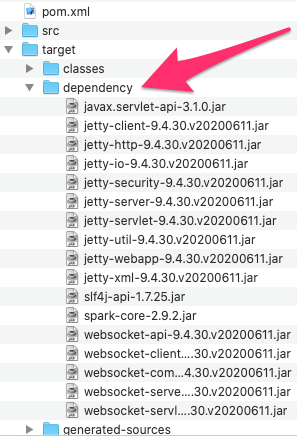
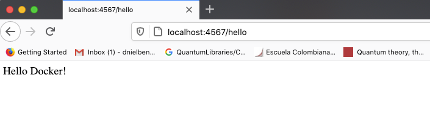
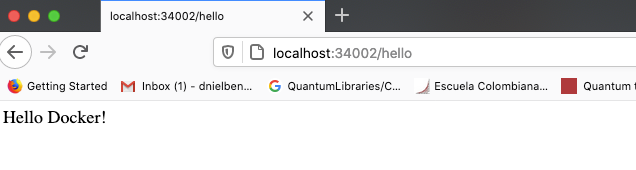
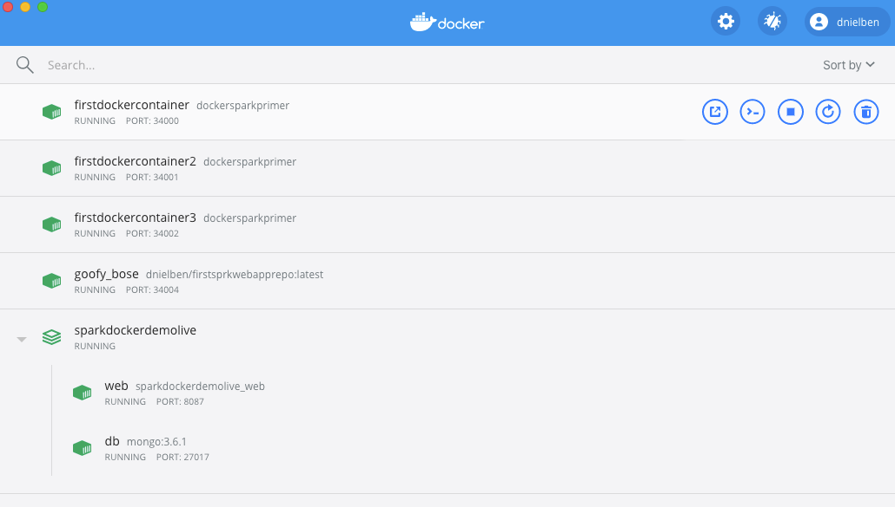
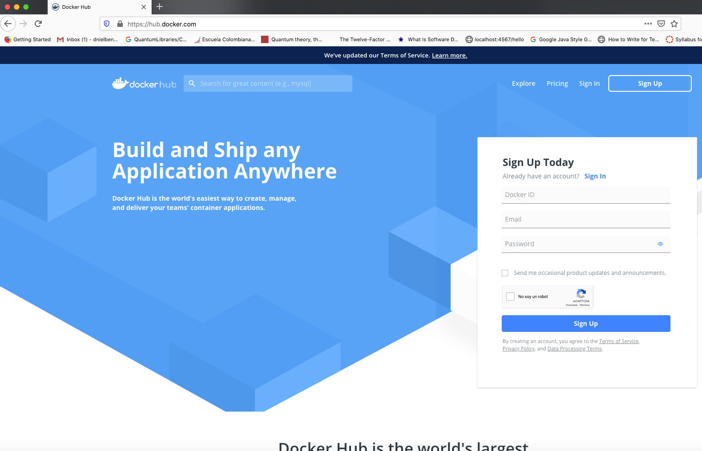
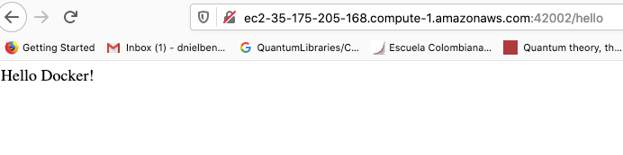

# Taller de Modularización con Virtualización e Introducción a Docker

**Apertura**: martes, 10 de marzo de 2026, 18:19  
**Cierre**: lunes, 16 de marzo de 2026, 23:59

En este taller profundizamos en los conceptos de modulación por medio de virtualización usando Docker y AWS.

### Pre-requisitos
1. El estudiante conoce Java y Maven.
2. El estudiante sabe desarrollar aplicaciones web en Java.
3. Tiene instalado Docker en su máquina.

## Descripción
El taller consiste en crear una aplicación web pequeña usando **SPRING**. Una vez tengamos esta aplicación, procederemos a construir un contenedor de Docker para la aplicación y lo desplegaremos y configuraremos en nuestra máquina local. 

Luego, crearemos un repositorio en **DockerHub** y subiremos la imagen al repositorio. Finalmente, crearemos una máquina virtual en **AWS**, instalaremos Docker y desplegaremos el contenedor que acabamos de crear.

## Primera parte: Crear la aplicación web

**1. Cree un proyecto Java usando Maven.**  
**2. Cree una aplicación Spring mínima.**


**Clase controlador:**
```java
import org.springframework.web.bind.annotation.GetMapping;
import org.springframework.web.bind.annotation.RequestParam;
import org.springframework.web.bind.annotation.RestController;

@RestController
public class HelloRestController {
    private static final String template = "Hello, %s!";

    @GetMapping("/greeting")
    public String greeting(@RequestParam(value = "name", defaultValue = "World") String name) {
        return String.format(template, name);
    }
}
```

**Clase para iniciar Spring:**

```java
@SpringBootApplication
public class RestServiceApplication {
    public static void main(String[] args) {
        SpringApplication app = new SpringApplication(RestServiceApplication.class);
        app.setDefaultProperties(Collections.singletonMap("server.port", getPort()));
        app.run(args);
    }

    private static int getPort() {
        if (System.getenv("PORT") != null) {
            return Integer.parseInt(System.getenv("PORT"));
        }
        return 5000;
    }
}
```

**3. Importe las dependencias de Spring en el archivo `pom.xml`.**
```xml
<dependencies>
    <dependency>
        <groupId>org.springframework.boot</groupId>
        <artifactId>spring-boot-starter-web</artifactId>
        <version>3.3.3</version>
    </dependency>
</dependencies>
```

**4. Asegúrese que el proyecto esté compilando hacia la versión 17 o superior de Java.**
```xml
<properties>
    <project.build.sourceEncoding>UTF-8</project.build.sourceEncoding>
    <maven.compiler.source>17</maven.compiler.source>
    <maven.compiler.target>17</maven.compiler.target>
</properties>
```

**5. Asegúrese que el proyecto esté copiando las dependencias en el directorio `target` al compilar.**  
Esto es necesario para poder construir una imagen de contenedor de Docker usando los archivos ya compilados de Java. Para hacer esto, use el plugin de dependencias de Maven.

**Configuración del build:**

```xml
<build>
    <plugins>
        <plugin>
            <groupId>org.apache.maven.plugins</groupId>
            <artifactId>maven-dependency-plugin</artifactId>
            <version>3.0.1</version>
            <executions>
                <execution>
                    <id>copy-dependencies</id>
                    <phase>package</phase>
                    <goals><goal>copy-dependencies</goal></goals>
                </execution>
            </executions>
        </plugin>
    </plugins>
</build>
```

**6. Asegúrese que el proyecto compila.**
```bash
$> mvn clean install
```
Debería obtener un output similar a este:

```text
[INFO] Scanning for projects...
[INFO] 
[INFO] ---------------< co.edu.escuelaing:sparkDockerDemoLive >----------------
[INFO] Building sparkDockerDemoLive 1.0-SNAPSHOT
[INFO] --------------------------------[ jar ]---------------------------------
[INFO] 
[INFO] --- maven-clean-plugin:2.5:clean (default-clean) @ sparkDockerDemoLive ---
[INFO] Deleting /Users/dnielben/Dropbox/01Escritorio/03Programas/AREP2020Talleres/sparkDockerDemoLive/
[INFO] 
[INFO] --- maven-resources-plugin:2.6:resources (default-resources) @ sparkDockerDemoLive ---
[INFO] Using 'UTF-8' encoding to copy filtered resources.
[INFO] skip non existing resourceDirectory /Users/dnielben/Dropbox/01Escritorio/03Programas/AREP2020Talleres/sparkDockerDemoLive/
[INFO] 
[INFO] --- maven-compiler-plugin:3.1:compile (default-compile) @ sparkDockerDemoLive ---
[INFO] Changes detected - recompiling the module!
[INFO] Compiling 1 source file to /Users/dnielben/Dropbox/01Escritorio/03Programas/AREP2020Talleres/sparkDockerDemoLive/
[INFO] 
[INFO] --- maven-resources-plugin:2.6:testResources (default-testResources) @ sparkDockerDemoLive ---
[INFO] Using 'UTF-8' encoding to copy filtered resources.
[INFO] skip non existing resourceDirectory /Users/dnielben/Dropbox/01Escritorio/03Programas/AREP2020Talleres/sparkDockerDemoLive/
[INFO] 
[INFO] --- maven-compiler-plugin:3.1:testCompile (default-testCompile) @ sparkDockerDemoLive ---
[INFO] Nothing to compile - all classes are up to date
[INFO] 
[INFO] --- maven-surefire-plugin:2.12.4:test (default-test) @ sparkDockerDemoLive ---
[INFO] No tests to run.
[INFO] 
[INFO] --- maven-jar-plugin:2.4:jar (default-jar) @ sparkDockerDemoLive ---
[INFO] Building jar: /Users/dnielben/Dropbox/01Escritorio/03Programas/AREP2020Talleres/sparkDockerDemoLive/1.0-SNAPSHOT.jar
[INFO] 
[INFO] --- maven-dependency-plugin:3.0.1:copy-dependencies (copy-dependencies) @ sparkDockerDemoLive ---
[INFO] Copying spark-core-2.9.2.jar to core-2.9.2.jar
[INFO] Copying slf4j-api-1.7.25.jar to api-1.7.25.jar
[INFO] Copying jetty-server-9.4.30.v20200611.jar to server-9.4.30.v20200611.jar
[INFO] Copying javax.servlet-api-3.1.0.jar to api-3.1.0.jar
[INFO] Copying jetty-http-9.4.30.v20200611.jar to http-9.4.30.v20200611.jar
[INFO] Copying jetty-util-9.4.30.v20200611.jar to util-9.4.30.v20200611.jar
[INFO] Copying jetty-io-9.4.30.v20200611.jar to io-9.4.30.v20200611.jar
[INFO] Copying jetty-webapp-9.4.30.v20200611.jar to webapp-9.4.30.v20200611.jar
[INFO] Copying jetty-xml-9.4.30.v20200611.jar to xml-9.4.30.v20200611.jar
[INFO] Copying jetty-servlet-9.4.30.v20200611.jar to servlet-9.4.30.v20200611.jar
[INFO] Copying jetty-security-9.4.30.v20200611.jar to security-9.4.30.v20200611.jar
[INFO] Copying websocket-server-9.4.30.v20200611.jar to server-9.4.30.v20200611.jar
[INFO] Copying websocket-common-9.4.30.v20200611.jar to common-9.4.30.v20200611.jar
[INFO] Copying websocket-client-9.4.30.v20200611.jar to client-9.4.30.v20200611.jar
[INFO] Copying jetty-client-9.4.30.v20200611.jar to client-9.4.30.v20200611.jar
[INFO] Copying websocket-servlet-9.4.30.v20200611.jar to servlet-9.4.30.v20200611.jar
[INFO] Copying websocket-api-9.4.30.v20200611.jar to api-9.4.30.v20200611.jar
[INFO] 
[INFO] --- maven-install-plugin:2.4:install (default-install) @ sparkDockerDemoLive ---
[INFO] Installing 1.0-SNAPSHOT.jar to .m2/repository/...
[INFO] ------------------------------------------------------------------------
[INFO] BUILD SUCCESS
[INFO] ------------------------------------------------------------------------
[INFO] Total time: 2.971 s
[INFO] Finished at: 2020-09-11T18:47:46-05:00
[INFO] ------------------------------------------------------------------------
```
**7. Asegúrese que las dependencias están en el directorio `target` y que contienen las librerías necesarias para correr en formato JAR.**  
En este caso, solo son las dependencias necesarias para correr SparkJava.

**8. Ejecute el programa invocando la máquina virtual de Java desde la línea de comandos y acceda a la URL `http://localhost:4567/hello`:**
```bash
java -cp "target/classes:target/dependency/*" co.edu.escuelaing.sparkdockerdemolive.RestServiceApplication
```

## Segunda Parte: Crear imagen para Docker y subirla

**1. En la raíz de su proyecto, cree un archivo denominado `Dockerfile` con el siguiente contenido:**






```dockerfile
FROM openjdk:8

WORKDIR /usrapp/bin

ENV PORT 6000

COPY /target/classes /usrapp/bin/classes
COPY /target/dependency /usrapp/bin/dependency

CMD ["java", "-cp", "./classes:./dependency/*", "co.edu.escuelaing.sparkdockerdemolive.SparkWebServer"]
```
**2. Usando la herramienta de línea de comandos de Docker, construya la imagen:**

```bash
docker build --tag dockersparkprimer .
```
**3. Revise que la imagen fue construida:**

```bash
docker images
```

Debería ver algo así:

```text
REPOSITORY          TAG       IMAGE ID       CREATED          SIZE
dockersparkprimer   latest    0c5dd4c040f2   49 seconds ago   514MB
openjdk             8         db530b5a3ccf   39 hours ago     511MB
```

**4. A partir de la imagen creada, cree tres instancias de un contenedor Docker.**  
Use la opción `-d` para correr en modo independiente y enlace el puerto 6000 del contenedor a diferentes puertos de su máquina física (opción `-p`):

```bash
docker run -d -p 34000:6000 --name firstdockercontainer dockersparkprimer
docker run -d -p 34001:6000 --name firstdockercontainer2 dockersparkprimer
docker run -d -p 34002:6000 --name firstdockercontainer3 dockersparkprimer
```

**5. Asegúrese que el contenedor está corriendo:**

```bash
docker ps
```

Debería ver algo así:

```text
CONTAINER ID   IMAGE               COMMAND                  CREATED         STATUS         PORTS                     NAMES
4e44267d49c0   dockersparkprimer   "java -cp ./classes:…"   4 minutes ago   Up 3 minutes   0.0.0.0:34002->6000/tcp   firstdockercontainer3
dd96c59d9798   dockersparkprimer   "java -cp ./classes:…"   4 minutes ago   Up 4 minutes   0.0.0.0:34001->6000/tcp   firstdockercontainer2
45f9b2769633   dockersparkprimer   "java -cp ./classes:…"   6 minutes ago   Up 6 minutes   0.0.0.0:34000->6000/tcp   firstdockercontainer
```

**6. Acceda por el navegador para verificar el funcionamiento:**  
Pruebe las siguientes URLs:
- `http://localhost:34000/hello`
- `http://localhost:34001/hello`
- `http://localhost:34002/hello`

**7. Use `docker-compose` para generar automáticamente una configuración de múltiples contenedores.**  
Por ejemplo, un contenedor para la aplicación web y otro para una instancia de MongoDB. Cree en la raíz de su directorio el archivo `docker-compose.yml` con el siguiente contenido:

```yaml
version: '2'

services:
  web:
    build:
      context: .
      dockerfile: Dockerfile
    container_name: web
    ports:
      - "8087:6000"
  db:
    image: mongo:3.6.1
    container_name: db
    volumes:
      - mongodb:/data/db
      - mongodb_config:/data/configdb
    ports:
      - 27017:27017
    command: mongod

volumes:
  mongodb:
  mongodb_config:
```



**8. Ejecute el docker-compose:**

```bash
docker-compose up -d
```

**9. Verifique que se crearon los servicios:**

```bash
docker ps
```

Debería ver algo así en la consola:

```text
CONTAINER ID   IMAGE                     COMMAND                  STATUS          PORTS                      NAMES
498500a0c6c6   mongo:3.6.1               "docker-entrypoint.s…"   Up 2 hours      0.0.0.0:27017->27017/tcp   db
394d835ccf8c   sparkdockerdemolive_web   "java -cp ./classes:…"   Up 2 hours      0.0.0.0:8087->6000/tcp     web
```


## Tercera parte: Subir la imagen a Docker Hub

**1. Cree una cuenta en Dockerhub y verifique su correo.**




**2. Acceda al menú de repositorios y cree un nuevo repositorio.**




**3. En su motor de Docker local, cree una referencia (tag) a su imagen con el nombre del repositorio donde desea subirla:**

```bash
docker tag dockersparkprimer dnielben/firstsprkwebapprepo
```

> [!NOTE]
> Si lo desea, puede usar tags para poner nombres específicos. Como solo tenemos una imagen, simplemente creamos una referencia con el nombre del repositorio y dejamos el mismo nombre de tag (en este caso "latest").

**4. Verifique que la nueva referencia de imagen existe:**

```bash
docker images
```

Debería ver algo así:

```text
REPOSITORY                      TAG       IMAGE ID       CREATED          SIZE
dnielben/firstsprkwebapprepo    latest    0c5dd4c040f2   26 minutes ago   514MB
dockersparkprimer               latest    0c5dd4c040f2   26 minutes ago   514MB
openjdk                         8         db530b5a3ccf   39 hours ago     511MB
```

**5. Autentíquese en su cuenta de Dockerhub:**

```bash
docker login
```

**6. Empuje la imagen al repositorio en DockerHub:**

```bash
docker push dnielben/firstsprkwebapprepo:latest
```

En la solapa de **Tags** de su repositorio en Dockerhub debería ver la nueva imagen.

## Cuarta parte: AWS

**1. Acceda a la máquina virtual (EC2).**  
**2. Instale Docker:**

```bash
sudo yum update -y
sudo yum install docker
```

**3. Inicie el servicio de Docker:**

```bash
sudo service docker start
```

**4. Configure su usuario en el grupo de Docker para no tener que usar `sudo` en cada comando:**

```bash
sudo usermod -a -G docker ec2-user
```

**5. Desconéctese de la máquina virtual e ingrese nuevamente para que la configuración de grupos surta efecto.**

**6. A partir de la imagen creada en Dockerhub, cree una instancia de un contenedor Docker independiente de la consola:**

```bash
docker run -d -p 42000:6000 --name firstdockerimageaws dnielben/firstsprkwebapprepo
```

**7. Abra los puertos de entrada del Security Group de la máquina virtual para acceder al servicio.**  
**8. Verifique el acceso en una URL similar a esta:**  
(La URL específica depende de su instancia EC2)

[http://ec2-35-175-205-168.compute-1.amazonaws.com:42002/hello](http://ec2-35-175-205-168.compute-1.amazonaws.com:42002/hello)

---

## TAREA

Para la tarea, usted debe construir una aplicación web y desplegarla en AWS usando EC2 y Docker.

### Requisitos:
- **Framework**: Debe utilizar su propio framework (**NO UTILIZAR SPRING**).
- **Mejoras**: Debe mejorar su framework para que sea concurrente y se pueda apagar de manera elegante.

### Entregables:
1. El código del proyecto en un repositorio de **GITHUB**.
2. Un **README** que explique:
    - Resumen del proyecto.
    - Arquitectura y diseño de clases.
    - Instrucciones para generar las imágenes y desplegarlo.
    - Pruebas de funcionamiento (pantallazos).
3. **Video** con los despliegues funcionando.

¡Muchos éxitos en el taller!



## Rúbrica de Evaluación del Proyecto

| General Information | Detail |
| :--- | :--- |
| **Programmer's Name** | |
| **Repository Link on GitHub** | |
| **Reviewer’s Name** | |
| **Review Date** | |

| Deliverables | Reference | Evaluation |
| :--- | :---: | :---: |
| Deployed on GitHub | 1 | 1 |
| Complete .gitignore file | 1 | 1 |
| Has README.md | 1 | 1 |
| Contains no unnecessary files or folders | 1 | 1 |
| Has a POM.xml | 1 | 1 |
| Respects Maven structure | 1 | 1 |
| Does not contain the target folder | 1 | 1 |
| **Subtotal Deliverables** | **7** | **7** |

| Design and Architecture | Reference | Evaluation |
| :--- | :---: | :---: |
| The framework supports concurrent requests, improving upon the previous version. | 5 | 5 |
| The framework shuts down gracefully using a Runtime Hook activated in a thread (see: [jvm-shutdown-hooks](https://www.baeldung.com/jvm-shutdown-hooks)) | 5 | 5 |
| Meets all other functional requirements | 3 | 3 |
| Meets quality attributes | 3 | 3 |
| The system has been deployed to a Docker container running in an EC2 instance on AWS. | 10 | 10 |
| System design seems reasonable for the problem | 3 | 3 |
| Design is well documented in the README.md | 3 | 3 |
| README contains installation and usage instructions | 3 | 3 |
| README shows evidence of tests | 3 | 3 |
| Has automated tests | 3 | 3 |
| Repository can be cloned and executed | 3 | 3 |
| **Subtotal Design** | **44** | **44** |

| Summary | Points | Evaluation |
| :--- | :---: | :---: |
| **Total** | **51** | **51** |
| **Final Grade** | **5** | **5** |


